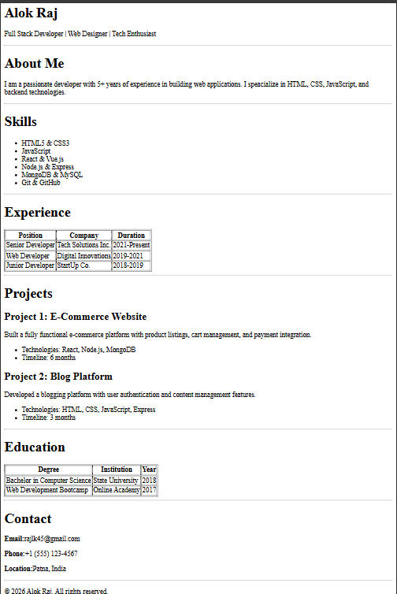

## 🌐 index.html

This is the main markup file for the project. It contains the raw content and structure of the webpage. The Assignment for the HTML.  

* **Type:** HTML5 Document
* **Usage:** Open in any modern browser (Chrome, Firefox, Safari) to view the project structure.

* I would like to extend my gratitude to ChaiCode team for providing me this opportunity.

